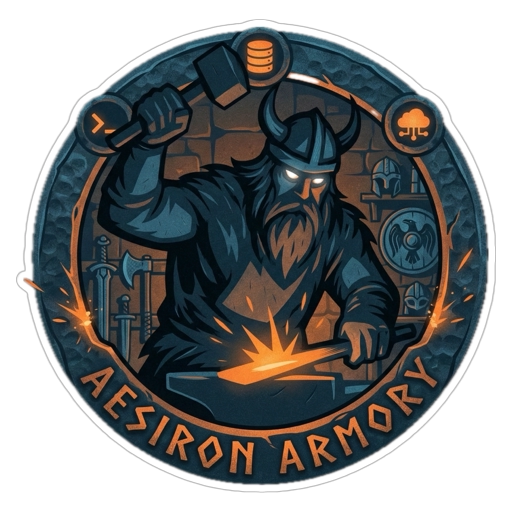

<div align="center">
  

  # 🛡️ Aesiron Armory
  
  **The ultimate collection of projects, tools, and applications forged with the [Aesiron](https://github.com/victorradael/aesiron) framework.**
  
  ---
</div>

## 📖 About

**Aesiron Armory** is the central repository dedicated to storing and maintaining all applications generated and powered by the **Aesiron** developer ecosystem (which streamlines the creation of Streamlit applications). 

Think of this repository as the showcase and storage—a true *armory*—for all out-of-the-box and custom projects built using the Aesiron CLI and automated pipelines.

## 🚀 Projects in the Armory

Currently, the armory houses the following specialized applications:

| Project | Description | Status |
| :--- | :--- | :---: |
| [**Build Keeper**](./build_keeper/) | An equipment tracker application designed with advanced UI/UX checklists, multi-editing features, and progression tracking. | 🟢 Active |

*(More projects will be minted and added here as the Aesiron framework expands!)*

## 🛠️ Getting Started

To explore or run any of the projects in the Armory locally:

1. **Clone the repository:**
   ```bash
   git clone https://github.com/victorradael/aesiron-armory.git
   cd aesiron-armory
   ```

2. **Setup the unified development environment:**
   The `aesiron-armory` supports a root virtual environment (`.venv`), ensuring your IDE perfectly syncs dependencies across all child applications.
   *(Make sure you have the related `aesiron` commands available or run your specific project setup)*

3. **Navigate to a project:**
   ```bash
   cd build_keeper
   # Follow the specific project's README or Makefile commands to run the app
   ```

## 🤝 Contributing & Using Aesiron

Want to build your own app? 
Check out the core engine repository to get started: **[Aesiron Core Framework](https://github.com/victorradael/aesiron)**. 

If you use Aesiron to craft a new tool, it belongs right here in the Armory!

---

<div align="center">
  <i>Forged with ⚔️ by <a href="https://github.com/victorradael">Victor Radael</a> and the Aesiron toolkit.</i>
</div>
